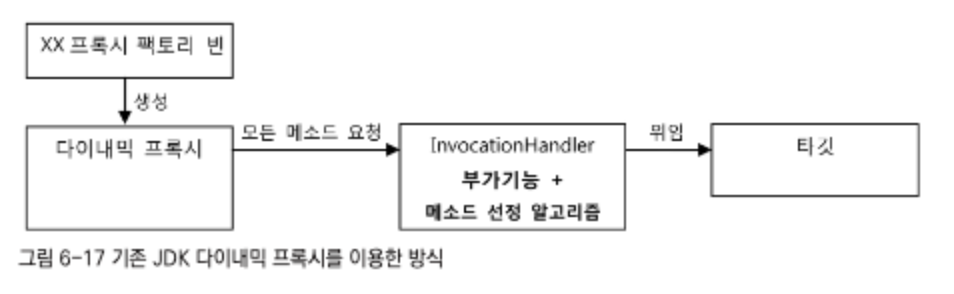
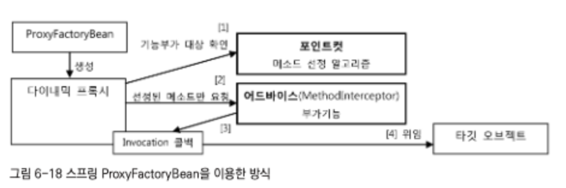
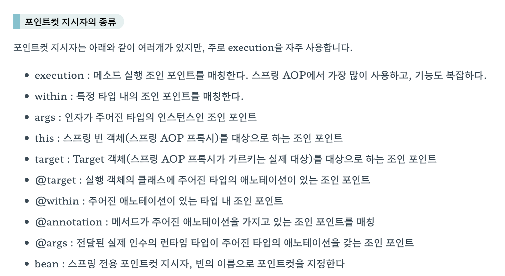

# 6장 AOP

- AOP는 IoC/DI, 서비스 추상화와 함께하는 스프링 3대 기반기술

## 6.1 트랜잭션 코드의 분리

- 기존의 코드는 트랜잭션과 비즈니스 로직의 코드가 혼재하고 있음

``` java
class UserService {

	public void upgradeLevels() {
        TransactionStatus status = this.transactionManager.getTransaction(new DefaultTransactionDefinition());

        try {
          	// 비즈니스 로직
            List<User> userList = userDao.getAll();

            for(User user : userList) {

                if (canUpgradeLevel(user)) {
                    upgradeLevel(user);
                }
            }
            this.transactionManager.commit(status);
        } catch (RuntimeException e) {
            this.transactionManager.rollback(status);
            throw e;
        }
    }

}
```


### 6.1.1 메소드 분리

- 트랜잭션과 비즈니스 로직을 분리해도 되는 이유

  1. 두 가지 종류의 코드가 구분되어 존재함

  2. 두 로직 사이에 서로 주고받는 정보가 없음

-  아래의 코드로 분리할 수 있음

``` java

class UserService {

	public void upgradeLevels() {

        TransactionStatus status = this.transactionManager.getTransaction(new DefaultTransactionDefinition());

        try {
            
            upgradeLevelsInternal();
            
            this.transactionManager.commit(status);
        } catch (RuntimeException e) {
            this.transactionManager.rollback(status);
            throw e;
        }
    }

  	// 비즈니스 로직
    private void upgradeLevelsInternal() {
        List<User> userList = userDao.getAll();

        for(User user : userList) {

            if (canUpgradeLevel(user)) {
                upgradeLevel(user);
            }
        }
    }

}
```


### 6.1.2 DI를 이용한 클래스의 분리

- 트랜잭션을 담당하는 코드가 UserService 내부에 같이 존재하는 것은 동일함
- UserService에서 보이지 않게 하고싶기 때문에 외부 클래스로 따로 분리

1. 현재 가지고 있는 강한 결합 구조 (현재 구조)


2. Client와 Service 로직 사이에 인터페이스를 구성하여 결합력을 약화시킨 구조
   - 인터페이스를 통해 간접적으로 구현 클래스에 접근
   - 결합이 약해지고, 유연한 확장이 가능한 장점이 있음


3. 한 인터페이스를 이용하는 구현 클래스를 두개로 구성하여, 트랜잭션과 비즈니스를 구분한 구조
   - 한 인터페이스에서 두 개의 구현 클래스를 이용
     - 일반적으로는 테스트와 정식 운영용을 구분하기 위해서 구성하는 방식
     - 하지만 한 번에 두개를 동시에 사용할 수도 있음 -> 지금 구성하려는 방식
   - 트랜잭션의 책임을 가지는 클래스와 비즈니스 로직을 가지는 클래스를 구성


``` java
// 다음의 인터페이스를 구성
public interface UserService {

    void add(User user);
    void upgradeLevels();

}
```

``` java
// 비즈니스 로직을 가지는 구현 클래스 구성
public class UserServiceImpl implements UserService {
  // ...
	public void upgradeLevels() {

        List<User> userList = userDao.getAll();

        for(User user : userList) {

            if (canUpgradeLevel(user)) {
                upgradeLevel(user);
            }
        }
    }

}
```

``` java
// 트랜잭션 로직을 가지는 구현 클래스 구성
public class UserServiceTx implements UserService {

  	// UserService를 구현한 다른 오브젝트를 DI
    UserService userService;
    PlatformTransactionManager transactionManager;

    public void setUserService(UserService userService) {
        this.userService = userService;
    }

  	// DI받은 UserService에 모든 비즈니스 로직을 위임
    @Override
    public void add(User user) {
        userService.add(user);
    }

    @Override
    public void upgradeLevels() {

        TransactionStatus status = this.transactionManager.getTransaction(new DefaultTransactionDefinition());

        try {
            userService.upgradeLevels();
            this.transactionManager.commit(status);
        } catch (RuntimeException e) {
            this.transactionManager.rollback(status);
            throw e;
        }

    }
}
```

- 구현 클래스 분리 후 구성하기를 원한 구조

  - 기존 userService 빈이 의존하던 transactionManager는 UserService의 빈이 의존
  - userDao, mainSender는 UserServiceImpl 빈이 의존하도록 Property 분리 (고려X)

  -> Client가 실행하는 userService를 호출할 때 UserServiceTx가 실행되어야함


- UserServiceTx에서 사용하는 userService를 userServiceImpl로 구성
- 스프링 어노테이션으로 빈 이름을 설정할 수도 있음


#### 트랜잭션 경계설정 코드 분리의 장점

1. 비즈니스 로직을 담당하는 UserServiceImpl의 코드를 작성할 때 트랜잭션을 신경쓰지 않아도 됨
2. 트랜잭션 여부 또한 신경쓰지 않아도 됨
3. 비즈니스 로직에 대한 테스트를 손쉽게 만들 수 있음


## 6.2 고립된 단위 테스트

- 테스트를 할 때 가장 좋은 방법은 가능한 한 작은 단위로 쪼개서 테스트하는 것
  1. 테스트에서 실패했을 때 원인을 찾기 쉬움
  2. 테스트의 의도/내용이 분명해짐
  3. 테스트를 만들기 쉬워짐

### 6.2.1 복잡한 의존관계 속의 테스트

- 작은 단위로 테스트하고싶어도, 다른 오브젝트와 환경에 의존한다면 작은 단위의 테스트가 주는 장점을 얻기 힘듬
  - 의존관계를 따라 등장하는 오브젝트와 서비스, 환경들이 모두 합쳐져서 테스트 대상이 되기 때문

- 다른 클래스의 코드에 종속되지 않도록 고립시킬 필요가 잇음

### 6.2.2 테스트 대상 오브젝트 고립시키기

- 테스트를 위한 대역(대체자)을 사용

### 6.2.3 단위 테스트와 통합 테스트


### 6.2.4 목 프레임워크


## 6.3 다이내믹 프록시와 팩토리 빈

### 6.3.1 프록시와 프록시 패턴, 데코레이터 패턴

#### 프록시

- 클라이언트가 사용하려고 하는 실제 대상인 것처럼 위장 -> 클라이언트의 요청을 대신 받아주는 대리자
- 부가기능이 마치 자신이 핵심기능을 가진 클래스인것처럼 꾸며서 핵심기능으로 가게 하는 것
- 핵심기능(타깃)과 같은 인터페이스를 구현한 부가기능임
- 프록시가 핵심기능을 제어할 수 있는 위치에 존재함


#### 사용목적

- 클라이언트가 핵심기능에 접근하는 방법을 제어하기 위함
- 핵심기능에 부가적인 기능을 부여하기 위함

-> 목적에 따라 디자인 패턴에서는 다른 패턴으로 구분함

#### 프록시 패턴

- 프록시: 클라이언트와 타깃 사이에 대리 역할인 오브젝트를 두는 방법을 총칭함
- 프록시 패턴: 프록시를 사용하는 방법 중 타깃에 대한 접근 방법을 제어하려는 목적을 가진 경우
- 타깃의 기능을 확장하거나 추가하지 않음
- 클라이언트가 타깃에게 접근하는 방식을 변경함
- 당장 필요하지 않은 오브젝트지만 레퍼런스는 필요하다면 이때 프록시를 넘김
- 원격 오브젝트에서 해당하는 프록시를 만들어주고, 클라이언트에서는 로컬에 존재하는 오브젝트를 쓰는 것처럼 프록시 사용
- 타깃에 대한 접근 권한을 제어하기 위해 사용하기도 함 -> 읽기 전용 메서드에 쓰기를 수행하면 예외 발생
- 타깃의 기능 자체에는 관여하지 않으면서 접근하는 방법을 제어하는 프록시

#### 데코레이터 패턴

- 타깃에 부가적인 기능을 런타임 시에 다이나믹하게 보여주기 위해 프록시를 사용하는 패턴
- 코드상에서는 어떤 방법, 순서로 프록시와 타깃이 연결되는지 정해지지 않음
- 프록시가 여러개여도 되며, 직접 타깃을 사용하도록 고정하지 않아도 됨
- 여러개의 프록시가 존재하면 순서를 정해서 단계적으로 위임하는 구조로 생성하면 됨


> **기능의 부가를 담당하는 프록시인지(데코레이터 패턴), 접근의 제어를 담당하는 프록시인지(프록시 패턴)**


### 6.3.2 다이내믹 프록시

- `java.lang.reflect` 패키지 내에 프록시를 쉽게 만들 수 있도록 하는 클래스들이 존재함
- 프록시 클래스를 정의하지 않고도, 몇 가지 API로 프록시처럼 동작하는 오브젝트를 다이내믹하게 생성

##### 프록시는 만들기 번거롭다

- 타깃의 인터페이스를 구현하고 위임하는 코드를 작성하기 번거로움
  - 부가기능이 필요없는 메소드도 구현해서 타깃으로 위임하는 코드를 만들어야함
- 부가기능 코드가 중복될 가능성이 많음
  - 트랜잭션의 경우 DB를 사용하는 대부분의 로직에 적용될 것

-> 이를 해결한 것이 JDK의 다이내믹 프록시임

##### 리플렉션

- 다이내믹 프록시는 리플렉션 기능을 이용하여 프록시를 만들어줌
- `클래스이름.class`로 하거나 Object의 `getclass()` 메소드를 호출하면 class 타입의 오브젝트를 가져옴
  - 클래스 코드의 메타정보를 가져오거나 오브젝트 조작 가능
- 런타임 시 동적으로 객체를 생성하는 기술

``` java
public class HelloUppercase implements Hello{
	Hello hello; 
  // 위임할 타깃 프로젝트
  // 타깃 클래스의 오브젝트인 것은 알지만 다른 프록시를 추가할수도 있으므로 인터페이스로 접근
	
	public HelloUppercase(Hello hello){
		this.hello = hello;
	}
	public String sayHello(String name){
		return hello.satHello(name).toUpperCase(); // 위임과 부가기능 적응 (모든 메소드에 중복해서 나타남)
	}
	public String sayHello(String name){
		return hello.sayHi(name).toUpperCase();
	}
	public String sayHello(String name){
		return hello.sayThankYou(name).toUpperCase();
	}
}
```

##### 다이내믹 프록시 적용

Dynamic Proxy: 프록시 팩토리에 의해 런타임 시 다이내믹하게 만들어지는 오브젝트

프록시를 만들 때마다 인터페이스를 구현해가면서 클래스를 정의하는걸 피할 수 있음

- Dynamic Proxy가 구현 클래스의 오브젝트는 만들어줌

``` java
// InvocationHandler 구현 클래스
public class UppercaseHandler implements InvocationHandler{
	Hello target; // 위임할 타겟 객체, 인터페이스로 접근
	
	public uppercaseHandler(Hello target){
		this.target =target;
	}
	
	public Object invoke(Object proxy, Method mothod,Object[] args) throws Throwable{
		String ret = (String)method.invoke(target,args);
		//타깃으로 위임 . 인터페이스의 메소드 호출에 모두 적용된다.
		return ret.toUpperCase(); //부가기능 제공
	}
}
```

- 다이내믹 프록시가 클라이언트로부터 받는 모든 요청은 invoke() 메소드로 전달됨
- 이후 리플렉션 API로 타깃 오브젝트의 메소드를 호출
- 호출된 후 `toUpperCase()` 부가기능 추가 후 반환


``` java
// 프록시 생성 - Hello 인터페이스를 구현한 클래스의 오브젝트 -> Hello로 캐스팅이 가능
Hello proxeHello = (Hello)Proxy.newProxtInstance(
	getClass().getClassLoader(), //동적으로 생성되는 다이내믹 프록시 클래스의 로딩에 사용할 클래스로더
	new Class[]{Hello.class}, //구현할 인터페이스
	new UppercaseHandler(new HelloTarget()) //부가기능과 위임 코드를 담은 InvocationHandler
);
```


##### 다이내믹 프록시 확장

``` java
// InvocationHandler 구현 클래스
public class UppercaseHandler implements InvocationHandler{
	Object target; // 위임할 타겟 객체, 인터페이스로 접근
	
	public uppercaseHandler(Object target){
		this.target =target;
	}
	
	public Object invoke(Object proxy, Method mothod,Object[] args) throws Throwable{
		Object ret = method.invoke(target,args);
		// 타깃으로 위임 . 인터페이스의 메소드 호출에 모두 적용된다.
		if (ret instanceof String && method.getName().startsWith("say")) { 
      // 문자열인 경우에만 대문자로 변환 & say로 시작하는 Method만 변환
      return ((String)ret).toUpperCase();
    }
    else {
      return ret;
    }
	}
}
```


### 6.3.3 다이내믹 프록시를 이용한 트랜잭션 부가기능

``` java
public class TrancationHandler implements InvocationHandler{
	private Object target;
	private Object PlatformTransactionManager transactionManager;
	private String pattern;
	
  // DI로 타겟 지정
	public void setTargetTarget(Object target){
		this.target = target;
	}
	
  // DI로 트랜잭션 추상화 인터페이스 지정
	public void setTransactionManaget(PlatformTransactionManager transactionManager){
		this.transactionManager = transactionManager;
	}
	
  // DI로 패턴 지정 (pattern에 따라 필터링 가능)
	public void setPattern(String pattern){
		this.pattern = pattern
	}
	
	public Object invoke(Object proxy,Method method,Object[] args)throws Throwable{
    //트랜잭션 적용 대상 메소드를 선별해서 트랜잭션 경계 설정 기능을 부여해준다.
		if(method.getName(),statusWith(pattern)){
			return invokeInTransaction(method,args);
		}else{
			return method.invoke(target,args);
		}
	}
	
	private Object invokeInTransaction(Method method,Object[] args)throws Throwable{
		TransactionStatus status =
			this.transactionManager.getTransaction(new DefaultTransactionDefinition());
		try{ 
      //트랜잭션을 시작
			Object ret = method.invoke(target,args); // 메소드 호출
			this.transactionManager.commit(status); // Commit
			return ret;
		}catch(InvocationTargetExcetion e){
			this.transactionManager.rollback(status); // 에러시 Rollback
			throw e.getTargetException();
		}
	}
}
```


### 6.3.4 다이내믹 프록시를 위한 팩토리 빈

- DI의 대상인 다이내믹 프록시 오브젝트는 일반적인 스프링 빈으로는 등록할 방법이 없음
  - 이름을 가지고 있으면 newInstance() 메소드로 오브젝트로 생성할 수 있는데, 다이내믹은 불가능
- 클래스 내부적으로 다이내믹하게 새로 정의해서 사용하기 때문에 프록시 오브젝트가 생성되지 않음
- 다이내믹 프록시는 Proxy 클래스의  newProxyInstance()라는 스태틱 팩토리 메소드로만 만들 수 있음

##### 팩토리 빈

- 팩토리 빈: 스프링을 대신해서 **오브젝트의 생성로직을 담당하도록 만들어진 특별한 빈**
- 클래스 정보를 가지고 디폴트 생성자로 오브젝트를 만드는 것 이외에도 여러 빈 생성 방법이 있음
- FactoryBean이라는 인터페이스를 구현하는게 가장 간단한 방법

``` java
// FactoryBean 인터페이스
public interface FactoryBean<T>{
	T getObject() throws Exception; // 빈오브젝트를 생성해서 돌려준다 .
	Class<? extends ?> getObjectType(); // 생성되는 오브젝트 타입을 알려준다.
	boolean isSingleton(); // getObject()가 돌려주는 오브젝트가 항상 같은 싱글톤인지 확인 
}
```

``` java
// 기본적인 Message 클래스
public class Massage{
	String text;
	
	private Message(String text){ 
    // 생성자가 private으로 선언되어 있어서 외부에서 생성자사용이 불가함
		this.text = text;
	}
	
	public String getText(){
		return text;
	}
	
	public static Message newMessage(String text){ 
    // 생성자 대신 사용할 수 있는 팩토리 메소드제공
		return new Message(text);
	}
}
```

- Message 클래스의 오브젝트 생성을 위해서는  newMessage() 스태틱 메소드를 사용해야함
  - 해당 클래스를 직접 스프링 빈으로 등록해서 사용할 수 없음
  - Static으로 오브젝트가 만들어져야하는 중요한 이유가 있어서 만든 것! 따라서 오브젝트를 강제로 생성하면 안됨

``` java
public class MessateFactoryBean implements FactoryBean<Message>{
	String text;
	
	/*
	오브젝트를 생성 할때 필요한 정보를 팩토리 빈의 프로퍼티로 설정해서 대신 DI 받을수 있게한다.
	*/
	public void setText(String text){
		this.text = text;
	}

	/*
    실제 빈으로 사용될 오브젝트를 직접 생성한다. 
    코드를 이용하기 때문에 복잡한 방식의 오브젝트 생성과 초기화 작업도 가능하다.
	*/
	public Message getObject() throws Exception{ // Type이 Message임
		return Massage.newMessage(this.text);
	}
	
	public Class<? extends Message>getObjectType(){
		return Message.class;
	}
	
	public boolean isSingleton(){
		return false;
	}
}
```


### 6.3.5 프록시 팩토리 빈 방식의 장점과 한계

- 코드의 수정 없이도 다양한 클래스에 적용할 수 있음

- 다이내믹 프록시 + 팩토리 빈을 이용한 DI까지 하면 다이내믹 프록시 생성 코드도 제거 가능

- 하나의 클래스 안에 존재하는 여러개의 메소드에 부가기능을 한번에 제공하는 것이 가능
- 하지만 한번에 여러개의 클래스에 공통적인 부가기능을 제공하는 방법은 불가능

-> 여러 클래스가 아닌 한 클래스의 여러 메소드에서만 부가기능을 한번에 제공이 가능함

- 하나의 타깃에 여러 부가기능을 적용할 때 프록시 팩토리 빈 설정도 부가기능 수만큼 붙음

-> 공통된 부가기능(트랜잭션)을 제공하는 동일 코드임에도 타깃 오브젝트가 달라지면 새로운 오브젝트를 만들어야함


## 6.4 스프링의 프록시 팩토리 빈

### 6.4.1 ProxyFactoryBean

- 스프링에서는 일관된 방법으로 프록시를 만들 수 있게 도와주는 추상 레이어를 제공함
- 생성된 프록시는 스프링의 빈으로 등록되어있어야 함
- 스프링에서는 프록시 오브젝트를 생성해주는 기술을 추상화한 팩토리빈을 제공해줌

#### ProxyFactoryBean

- 프록시를 생성해서 빈 오브젝트로 등록하게 해주는 팩토리 빈
- 순수하게 프록시를 생성하는 작업만을 담당하며, 프록시를 통해 제공하는 부가기능은 별도의 빈에 둘 수 있음
- ProxyFactoryBean이 생성하는 프록시에서 사용할 부가기능은  MethodInterceptor 인터페이스를 구현

##### MethodInterceptor

- invoke() 메소드가 ProxyFactoryBean으로부터 타깃 오브젝트에 대한 정보까지 함께 제공받음
- 타깃이 다른 여러 프록시에서 함께 사용할 수 있고, 싱글톤 빈으로 등록이 가능함

##### InvocationHandler

- invoke() 메소드는 타깃 오브젝트에 대한 정보를 제공하지 않음

#### 다이내믹 프록시와의 차이점

- MethodInterceptor에는 메소드 정보와 함께 타깃 오브젝트가 담긴 MethodInvocation 오브젝트가 전달됨
  - MethodInvocation은 타깃 오브젝트의 메소드를 실행하는 기능을 가짐
  - MethodInterceptor는 부가기능을 제공하는데에만 집중할 수 있음
- 수정자 메소드를 사용하는 것 대신 addAdvice()라는 메소드를 사용 MethodInterceptor를 설정함
  - ProxyFactoryBean에는 여러개의  MethodInterceptor를 추가할 수 있음
  - 1개의 ProxyFactoryBean으로 여러개의 부가기능을 제공할 수 있음
- 기본적으로 JDK가 제공하는 다이내믹 프록시를 만들어줌

#### 부가기능 적용 대상 메소드 선정 방법

- MethodInterceptor 오브젝트는 타깃 정보를 가지고 있지 않음
- 여러 프록시가 공유하기 때문에 MethodInterceptor에 특정 프록시에만 적용되는 기능을 넣으면 안됨

##### 어드바이스

- 부가기능을 제공하는 오브젝트

##### 포인트컷

- 메소드 선정 알고리즘을 담은 오브젝트

이 두가지는 모두 프록시에  DI로 주입되어 사용됨

##### 적용 대상 선정방법

1. 프록시가 클라이언트로 요청을 받음
2. 포인트컷에서 부가기능을 부여할 메소드인지 확인
3. 맞다면 MethodIntercpetor 타입의 어드바이스를 호출

``` java
@Test
public void pointcutAdvisor(){
	ProxyFactoryBean pfBean = new ProxyFactoryBean();
	pfBean.setTarget(new HelloTarget());
	
	NameMatchMethodPointcut pointcut = new NameMatchMethodPointcut(); // 포인트컷
	pointcut.setMappedName("sayH*"); //sayH로 시작하는 모든 메소드가 대상이 됨
	
	pfBean.addAdvisor(new DefaultPointcutAdvisor(pointsut,new UppercaseAdvice()));
	//포인트컷과 어드바이스를 Advisor로 묶어서 한번에 추가 
	Hello proxideHello = (Hello)pfBean.getObject();
	
	assertThat(proxiedHello.sayHello("Toby"),is("HELLO TOBY"));
	assertThat(proxiedHello.sayHI("Toby"),is("HI TOBY"));
	assertThat(proxiedHello.sayThankYou("Toby"),is("Thank You TOBY"));
	//조건에 부합하지 않으므로 대문자변환이 되지 않음
}
```





### 6.4.2 ProxyFactoryBean 적용


## 6.5 스프링 AOP

- 부가기능의 적용이 필요한 타깃 오브젝트마다 비슷한 ProxyFactoryBean 빈 설정정보를 추가하는 부분을 진행해야함
- 설정은 매번 복사해서 붙이고 타겟 프로퍼티 내용을 수정해야함

### 6.5.1 자동 프록시 생성

- BeanPostProcessor 인터페이스를 구현해서 빈 후처리기를 구현할 수 있음
- 빈 후처리기는 스프링 빈 오브젝트로 만들어진 후, 빈 오브젝트를 다시 가공할 수 있게 해줌

### 6.5.2 DefaultAdvisorAutoProxyCreator의 적용

- DefaultAdvisorAutoProxyCreator는 어드바이저를 이용한 자동 프록시 생성기임 (빈 후처리기 중 하나)
- 빈 후처리기를 스프링에 적용하는 방법은 해당 후처리기 차제를 빈으로 등록하는 것
  - 빈 오브젝트가 생성될 때마다 빈 후처리기에 보내서 후처리 작업을 요청함

1. 빈 후처리기가 등록되어있으면 스프링에서 빈 오브젝트를 만들 때마다 후처리기에 해당 빈을 보냄
2. 빈에 등록된 모든 어드바이저 내의 포인트컷으로 전달받은 빈이 프록시 적용 대상인지 확인
3. 맞다면 내장된 프록시 생성기에게 현재 빈에 대한 프록시를 만들게 하고, 어드바이저를 프록시에 연결
4. 프록시가 생성되면 빈 후처리기는 전달받은 빈 오브젝트 대신 프록시 오브젝트를 컨테이너에 반환
5. 컨테이너는 최종적으로 빈 후처리기가 반환한 오브젝트(프록시 오브젝트)를 빈으로 등록하고 사용

### 6.5.3 포인트컷 표현식을 이용한 포인트컷

- 메소드의 이름과 클래스의 이름 패턴을 각각 클래스 필터와 메소드 매처 오브젝트로 비교해서 선정
  - 하나씩 클래스 필터와 메소드 매처를 구현하거나 스프링이 제공하는 것을 가져와 프로퍼티를 설정해야함
- 포인트컷 표현식으로 포인트컷의 클래스와 메소드를 선정하는 알고리즘을 작성할 수 있음
  - AspectJ 포인트컷 표현식이라고도 함 (AspectJ에서 가져와서 일부를 확장해서 사용)
- execution - 메소드 실행 조인 포인트 지정
- within - 특정 타입 내 조인 포인트 매칭
- args - 인자가 주어진 타입의 인스턴스인 조인 포인트
- 등등...



### 6.5.4 AOP란 무엇인가?

- Aspect Oriented Programming - AOP
- 애플리케이션의 핵심적인 기능에서 부가적인 기능을 분리해서 Aspect라는 모듈로 만들어서 설계

### 6.5.5 AOP 적용기술


### 6.5.6 AOP의 용어

- 타깃 - 부가기능을 부여할 대상
- 어드바이스 - 타깃에세 제공할 부가기능을 담은 모듈
  - 메소드 호출 과정에 전반적으로 참여하는 것도 있고, 일부 과정에서만 동작하는 것도 있음
- 조인포인트 - 어드바이스가 적용될 수 있는 위치
  - AOP에서 조인 포인트는 메소드의 실행 단계임
- 포인트컷 - 어드바이스를 적용할 조인 포인트를 선별하는 작업 또는 그 기능을 정의한 모듈
- 프록시 - 클라이언트와 타깃 사이에서 부가기능을 제공하는 오브젝트
- 어드바이저 - 포인트컷과 어드바이스를 하나씩 가지고 있는 오브젝트
  - 스프링 AOP에서만 사용되는 용어
- 애스팩트 - AOP의 기본 모듈, 스프링의 어드바이저는 아주 단순한 애스팩트

### 6.5.7 AOP 네임스페이스

- 스프링의 프록시 방식 AOP를 적용하려면 최소한 네 가지 빈을 등록해야함

1. 자동 프록시 생성기 - 빈으로 등록된 어드바이저로 프록시를 자동 생성하는 기능을 담당함
2. 어드바이스 - 부가기능을 구현한 클래스를 빈으로 등록
3. 포인트컷 - AspectJExpressionPointcut을 빈으로 등록하고 expression 프로퍼티에 표현식을 넣으면 됨
4. 어드바이저 - DefaultPointcutAdvisor 클래스를 빈으로 등록해서 사용ㅇ
