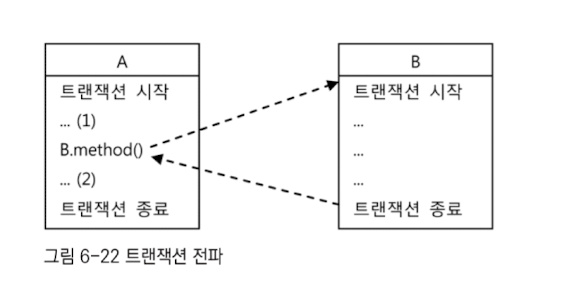
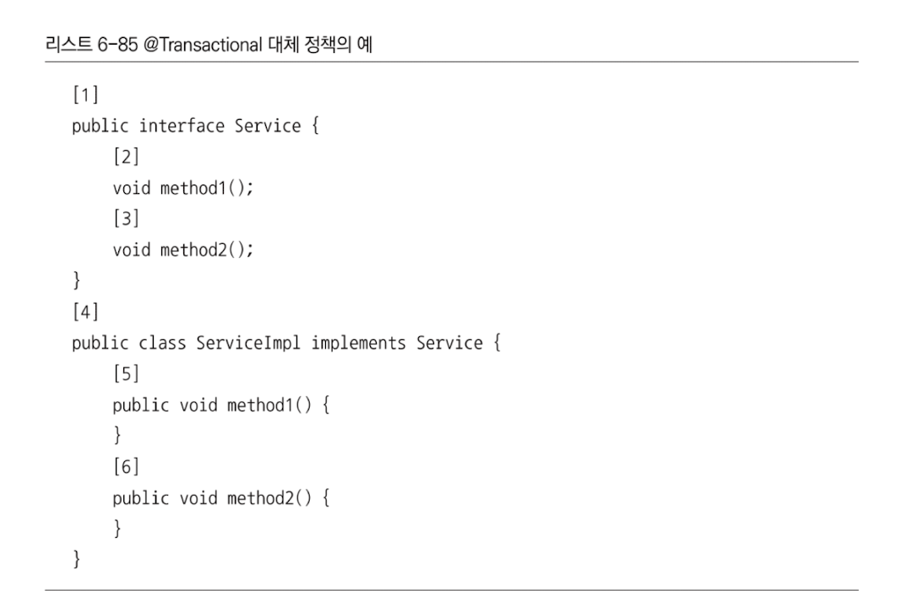
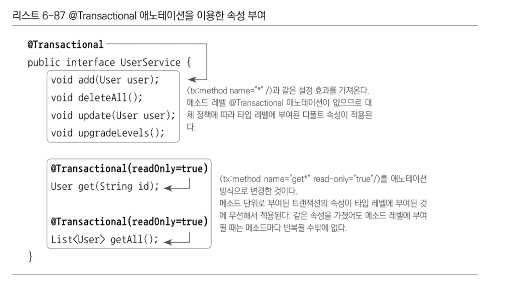

# 3주차 트랜잭션

## 6.6 트랜잭션 속성

### 6.6.1 트랜잭션 정의

- 트랜잭션의 종류는 여러가지가 있지만 모두 같은 방식으로 동작하지는 않음
- 그래도 기본 개념인 더이상 쪼갤 수 없는 최소단위의 작업이라는 개념은 항상 유효함
  - commit()으로 모두 성공하던지, rollback()으로 모두 취소되어야 함

- DefaultTransactionDefinition이 구현하고 있는 TransactionDefinition 인터페이스는 트랜잭션의 동작 방식에 영향을 줄 수 있는 네 가지 속성을 정의하고 있음

#### 트랜잭션 전파

- 2트랜잭션의 경계에서 이미 진행중인 트랜잭션이 있을 때나 없을 때 어떻게 동작할 것인가를 결정하는 방식

- 각각 독립적인 트랜잭션 경계를 가진 두 개의 코드가 있을 때

  - A의 트랜잭션이 시작되고 끝나지 않았는데, B를 호출했다면 B는 어떤 트랜잭션에서 동작해야하는지

  - 예를 들어 A에서 이미 진행중이라면 B는 새로운 트랜잭션을 만들지 않고 A에서 이미 시작한 트랜잭션에 참여할 수 있음

    

- 위처럼 독자적인 트랜잭션 경계를 가진 코드에 대해 이미 진행중인 트랜잭션이 어떻게 영향을 미칠 수 있는가를 정의하는 것이 트랜잭션 전파 속성

##### 종류

1. PROPAGATION_REQUIRED
   - 가장 많이 사용되는 트랜잭션 전파 속성
   - 진행중인 트랜잭션이 없으면 새로 시작하고, 이미 시작된 트랜잭션이 있으면 이에 참여
   - DefaultTransactionDefinition의 트랜잭션 전파 속성에 해당함

2. PROPAGATION_REQUIRES_NEW
   - 항상 새로운 트랜잭션을 시작함
   - 독립적인 트랜잭션이 보장되어야 하는 코드에 적용할 수 있음

3. PROPAGATION_NOT_SUPPORTED
   - 트랜잭션 없이 동작하도록 만들 수 있음
   - 진행 중인 트랜잭션이 있어도 무시 가능
   - 왜?
     - 트랜잭션 경계설정은 보통 AOP를 사용해서 한 번에 많은 메소드에 동시에 적용하는 방법을 사용
     - 특별한 메소드만 트랜잭션 적용에서 제외하기 위함

- getTransaction()이라는 메소드로 트랜잭션을 시작하는 이유는 이런 전파 속성 때문임

#### 격리수준

- 모든 DB 트랜잭션은 격리수준을 가지고 있어야 함
- 모든 트랜잭션이 순차적으로 진행될면 성능이 크게 떨어지기 때문에 이런 수준을 적절하게 조절해야함
- 기본적으로 DB에 설정되어있지만, JDBC 드라이버나 DataSource 등에서 재설정이 가능
- 필요하다면 트랜잭션 단위로도 수준 조정이 가능함
- DefaultTransactionDefinition에 설정된 격리수준은 ISOLATION_DEFAULT임

#### 제한시간

- 트랜잭션을 수행하는 제한시간을 설정할 수 잇음
- DefaultTransactionDefinition의 기본 설정은 제한 시간이 없음
- PROPAGATION_REQUIRED나 PROPAGATION_REQUIRES_NEW와 함께 사용해야 의미가 있음

#### 읽기전용

- 트랜잭션 내에서 데이터 조작 시도를 막을 수 있음
- 또한 데이터 액세스 기술에 따라 성능이 향상될 수도 있음

### 6.6.2 트랜잭션 인터셉터와 트랜잭션 속성

- 메소드별로 다른 트랜잭션 정의를 적용하려면 어드바이스의 기능을 확장해야함

#### TransactionInterceptor

- 스프링의 TransactionInterceptor를 이용

- 트랜잭션 정의를 메소드 이름 패턴을 이용해서 다르게 지정할 수 있는 방법을 추가로 제공함

- PlatformTransactionManager와 Properties 타입의 두 가지 프로퍼티를 가짐

  ``` java
  public Object invoke(MethodInvocation invocation)throws Throwable{
      TransactionStatus status =
          this.transactionManager.getTransaction(new DefaultTransactionDefinition());
          try{
              Object ret = invocation.proceed();
              this.transactionManager.commit(status);
              return ret;
          } catch(RuntimeException e){ // RuntimeException일 때만 Rollback
              this.transactionManager.rollback(status);
              throw e;
          }
  }
  ```

  - Runtime Exception이 아닐 때에는 트랜잭션이 제대로 처리되지 않고 해당 메서드를 빠져나감
  - TransactionInterceptor에는 기본적으로 두 가지 종류의 예외처리 방식이 존재함
    - RuntimeException(Unchecked Exception)에서 트랜잭션 롤백
    - 런타임 예외가 아닌 나머지 예외(Checked Exception)를 던지는 경우에는 예외 상황으로 해석하지 않고 일종의 비즈니스 로직에 따른 의미가 있는 리턴 방식의 한 가지로 인식해버림
  - TransactionInterceptor의 이런 기본 원칙을 따르지 않을 수도 있음
    - 따라서 TransactionAttribute는 rollbackOn()이라는 속성으로 기본 원칙과 다른 예외처리가 가능하도록 함
    - Map 타입으로 TransactionAttribute를 입력받는데, 메소드 패턴에 따라 다른 트랜잭션 속성을 부여할 수 있도록 하기 위함임

#### 메소드 이름 패턴을 이용한 트랜잭션 속성 지정

``` java
<bean id="transactionAdvice"
class="org.springframework.transaction.interceptor.Transactionlnterceptor">
    <property name="transactionManager" ref="transactionManager" />
    <property name="transactionAttributes">
        <props>
            <prop key="get*">PROPAGATION_REQUIRED,readOnly , timeout_30</prop>
            <prop key=“upgrade*">PROPAGATION_REQUIRES_NEW, ISOLATION_SERIALIZABLE
            </prop>
            <prop key="*">PROPAGATION_REQUIRED</prop>
        </props>
    </property>
</bean>
```

- 메소드 이름 패턴(get*)과  문자열 트랜잭션 속성으로 정의한 TransactionInterceptor 타입 빈의 예시
  - get으로 시작하는 모든 메소드의 속성 (PROPAGATION_REQUIRED, 읽기전용, 30초 제한)
  - upgrade로 시작하는 모든 메소드의 속성 (PROPAGATION_REQUIRES_NEW, 고립상태 격리)
  - 나머지 PROPAGATION_REQUIRED
  - 지정되지 않은 속성은 기본값으로 지정됨

### 6.6.3 포인트컷과 트랜잭션 속성의 적용 전략

1. 트랜잭션 포인트컷 표현식은 타입 패턴이나 빈 이름을 이용
2. 공통된 메소드 이름 규칙을 통해 최소한의 트랜잭션 어드바이스와 속성을 정의함
   - 가장 간단한 속성 부여방법은 디폴트 속성을 모든 메서드에 지정하는 것
   - 개발이 진행될 때마다 단계적으로 속성을 추가
   - 일정한 이름 명명 규칙을 가지도록 함
   - 일반화하기 애매한 타깃은 별도의 어드바이스/포인트컷을 사용
3. 프록시 방식 AOP는 같은 타깃 오브젝트 내의 메소드를 호출할 때는 적용되지 않음
   - 프록시 방식의 AOP에서 프록시를 통한 부가기능의 적용은 클라이언트 호출이 일어날 때만 가능함
   - 타깃 오브젝트가 자기 자신의 메소드를 호출할 때에는 프록시를 통한 부가기능의 적용이 발생하지 않음
   - 프록시가 적용되는 방식을 생각

### 6.6.4 트랜잭션 속성 적용

- pass

## 6.7 애노테이션 트랜잭션 속성과 포인트컷

- 포인트컷 표현식과 트랜잭션 속성으로 트랜잭션을 일괄 적용하는 것은 일반적인 상황에서 잘 들어맞음
- 가끔세밀하게 튜닝된 트랜잭션 속성을 적용해야 하는 경우도 있음
- 세밀한 속성의 제어가 필요한 경우를 위해 트랜잭션 속성정보를 가진 애노테이션을 지정할 수 있음

### 6.7.1 트랜잭션 애노테이션

#### `@Transactional`

``` java
@Target({ElemntType.METHOD,ElementType.TYPE})
// 어노페이션을 사용할 대상을 지정함 
// 여기에 사용된 "메소드와 타입(클래스,인터페이스)처럼 한개 이상의 대상 지정 가능
@Retention(RetentionPolicy.RUNTIME)
// 어노테이션 정보가 언제까지 유지되는지를 지정
@Inherited
// 상속을 통해서도 어노테이션 정보를 얻을 수 있음
@Documnetde
public @interface Transactional{
// 트랜잭션 속성의 모든 항목을 앨리먼트로 지정 가능
// 디폴트 값이 설정되어 있으므로 모두 생략 가능
  String value() default "";
  Propagation propagation() default Propagation.REQUIRED;
  Isolation isolation() default Isolation.DEFAULT;
  int timeout() default TransactionDefinition.TIMEOUT_DEFAULT;
  boolean readOnly() default false;
  Class? extends Throwable〉[] rollbackFor() default t};
  Stringl] rollbackForClassName() default {};
  Class? extends Throwable〉[] noRollbackFor() default {};
  Stringl] noRollbackForClassName() default {};
}
```

- 타깃은 메소드와 타입 -> 메소드 클래스, 인터페이스에 사용
- 기본적으로 트랜잭션 속성을 정의하는 것이지만, 동시에 포인트컷의 자동등록에도 사용함


#### 트랜잭션 속성을 이용하는 포인트컷

- `@Transactional`은 메소드마다 다르게 설정 가능하여 매우 유연한 트랜잭션 속성 설정이 가능함
- 동시에 포인트컷도 이 애노테이션으로 트랜잭션 속성정보를 참조하도록 함
  - 애노테이션으로 트랜잭션 속성이 부여되었으면 포인트컷의 선정대상이기도 하기 때문
- 트랜잭션 부가기능 적용 단위는 메서드이기 때문에 메서드마다 @Transactional을 부여하고 속성 지정이 가능함
- 유연한 제어는 가능하짐나, 코드가 지저분해지고 반복적으로 부여해주어야 함

#### 대체 정책

- 스프링은 @Transactional을 적용할 때 4단계의 대체 정책을 이용하게 해줌

- 메소드의 속성을 확인할 때

  1. 타깃 메소드
  2. 타깃 클래스
  3. 선언 메소드
  4. 선언 타입

- 의 순서에 따라 @Transactional이 적용되었는지 차례로 확인하고 가장 먼저 발견되는 속성을 사용하게 됨

  

- 5, 6이 @Transactional이 위치할 수 있는 첫 번째 후보

- 다음은 4 -> 2, 3 -> 1 순으로 확인하게 됨

### 6.7.2 트랜잭션 애노테이션 적용



- 위 이미지처럼 세분화해서 사용할 수 있음

## 6.8 트랜잭션 지원 테스트

### 6.8.1 선언적 트랜잭션과 트랜잭션 전파 속성

- 트랜잭션 전파 속성은 매우 유용한 개념임
  - REQUIRED로 전파 속성 지정 -> 앞에서 진행중인 트랜잭션이 있으면 참여하고, 없으면 새로운 트랜잭션을 시작
  - 불필요한 코드 중복 회피, 작은 기능 단위로 쪼개서 개발이 가능함
  - 스프링은 트랜잭션 전파 속성을 선언적으로 적용할 수 있는 기능을 제공함
    - 다만 개발자의 부주의나 게으름으로 발생하는 중복을 막아주지는 못함
- 선언전 트랜잭션: AOP를 이용해 코드 외부에서 트랜잭션의 기능을 부여해주고 속성을 지정할 수 있게 하는 방법
- 프로그램에 의한 트랜잭션: TransactionTemplate나 개별 기술의 트랜잭션 API로 직접 사용하는 방법

### 6.8.2 트랜잭션 동기화와 테스트

- 트랜잭션의 자유로운 전파의 배경 - AOP & 트랜잭션 추상화

#### 트랜잭션 매니저와 트랜잭션 동기화

- PlatformTransactionManager 인터페이스를 구현한 트랜잭션 매니저로 일관된 제어가 가능
- 트랜잭션 동기화 기술로 인해 트랜잭션 정보를 저장소에 보관해 두고 DAO에서 공유할 수 있음
  - 트랜잭션 동기화 기술은 트랜잭션 전파를 위해서도 중요한 역할을 함

#### 트랜잭션 매니저를 이용한 테스트용 트랜잭션 제어

pass

### 6.8.3 테스트를 위한 트랜잭션 애노테이션

- 테스트에도 @Transactional을 적용할 수 있음
- @Rollback
  - 테스트용 트랜잭션은 테스트가 끝나면 자동으로 롤백됨
  - 그대로 DB에 반영하고싶으면 @Rollback 어노테이션을 사용하면 됨
    - `@Rollback(false)`
- @TransactionConfiguration
  - 테스트 클래스의 모든 메소드에 트랜잭션을 적용하면서 커밋되에 하는 방식
  - 어노테이션을 클래스 레벨에 부여할 수 있음
- @NotTransactional: 트랜잭션을 시작하지 않은 채로 테스트를 진행함 -> Deprecated 됨

## 6.9 정리

- 트랜잭션 경계설정 코드를 분리해서 별도의 클래스로 만들고 비즈니스 로직 클래스와 동일
  한 인터페이스를 구현하면 DI의 확장 기능을 이용해 클라이언트의 변경 없이도 깔끔하게 분
  리된 트랜잭션 부가기능을 만들 수 있다.

- 트랜잭션처럼 환경과 외부 리소스에 영향을 받는 코드를 분리하면 비즈니스 로직에만 충실
  한 테스트를 만들 수 있다.

- 목 오브젝트를 활용하면 의존관계 속에 있는 오브젝트도 손쉽게 고립된 테스트로 만들 수 있
  다.
- DI를 이용한 트랜잭션의 분리는 데코레이터 패턴과 프록시 패턴으로 이해될 수 있다.
- 번거로운 프록시 클래스 작성은 JDK의 다이내믹 프록시를 사용하면 간단하게 만들 수 있
  다.
- 다이내믹 프록시는 스태틱 팩토리 메소드를 사용하기 때문에 빈으로 등록하기 번거롭다. 따
  라서 팩토리 빈으로 만들어야 한다. 스프링은 자동 프록시 생성 기술에 대한 추상화 서비스를
  제공하는 프록시 팩토리 빈을 제공한다.
- 프록시 팩토리 빈의 설정이 반복되는 문제를 해결하기 위해 자동 프록시 생성기와 포인트컷
  을 활용할 수 있다. 자동 프록시 생성기는 부가기능이 담긴 어드바이스를 제공하는 프록시를
  스프링 컨테이너 초기화 시점에 자동으로 만들어준다.
- 포인트컷은 AspectJ 포인트컷 표현식을 사용해서 작성하면 편리하다.
- AOP는 00P만으로는 모듈화하기 힘든 부가기능을 효과적으로 모듈화하도록 도와주는 기
  술이다.
- 스프링은 자주 사용되는 AOP 설정과 트랜잭션 속성을 지정하는 데 사용할 수 있는 전용 태
  그를 제공한다.
- AOP를 이용해 트랜잭션 속성을 지정하는 방법에는 포인트컷 표현식과 메소드 이름 패턴을
  이용하는 방법과 타깃에 직접 부여하는 @Transactional 애노테이션을 사용하는 방법이 있
  다.
- @Transactional을 이용한 트랜잭션 속성을 테스트에 적용하면 손쉽게 DB를 사용하는 코드
  의 테스트를 만들 수 있다.
