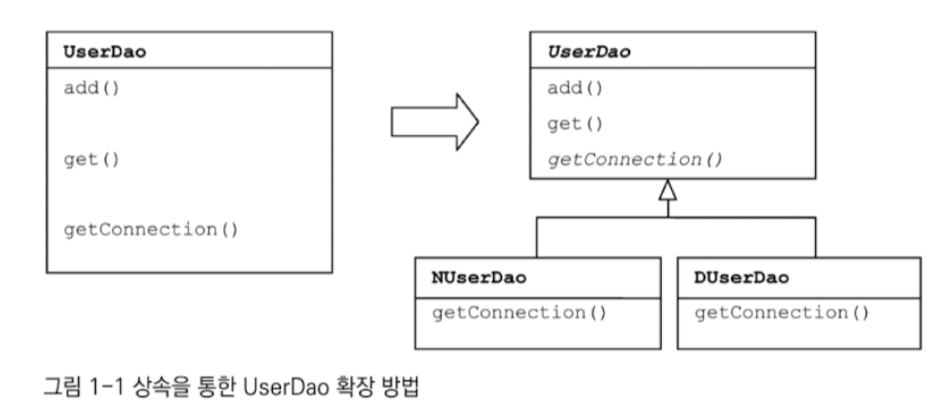
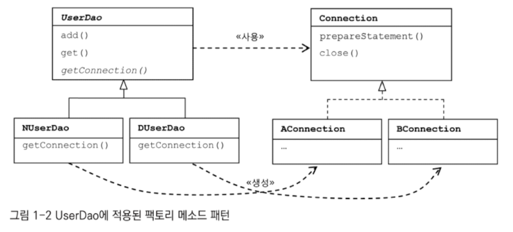
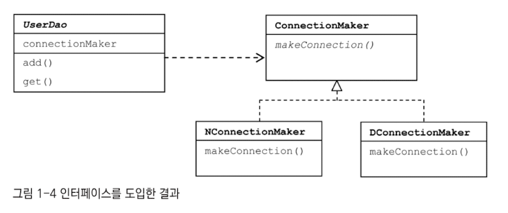
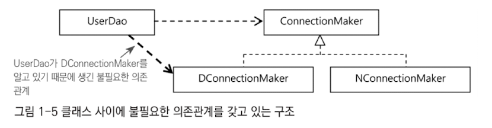
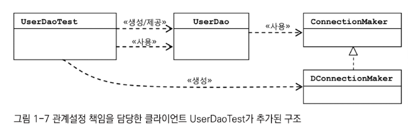
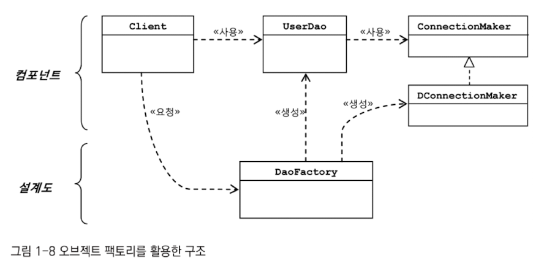
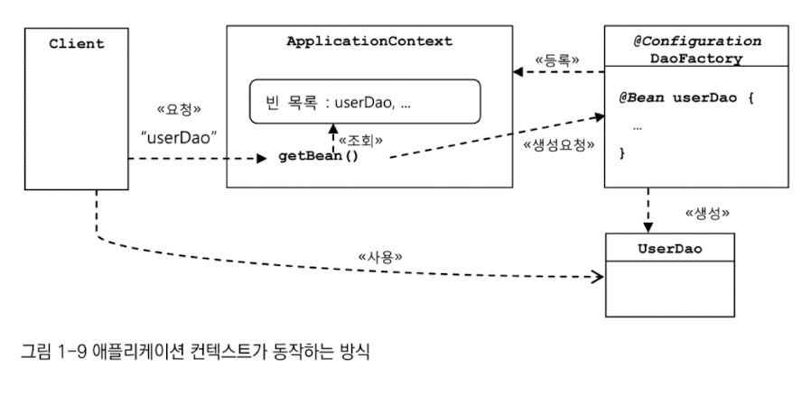

# 4주차 1장 오브젝트와 의존관계

- 스프링이 자바에서 가장 중요하게 가치를 두는 것 -> 객체지향 프로그래밍이 가능한 언어라는 점

## 1.1 초난감 DAO

### 1.1.1 User

``` java
public class User {

    String id;
    String name;
    String password;

    public String getId() {
        return id;
    }

    public void setId(String id) {
        this.id = id;
    }

    public String getName() {
        return name;
    }

    public void setName(String name) {
        this.name = name;
    }

    public String getPassword() {
        return password;
    }

    public void setPassword(String password) {
        this.password = password;
    }
}

```


``` java
create table users (
                       id varchar(10) primary key,
                       name varchar(20) not null,
                       password varchar(10) not null
)
```

### 1.1.2 UserDao

``` java
public class UserDao {
	public void add(User user) throws ClassNotFoundException, SQLException {
    	Class.forName("com.mysql.jdbc.Driver");
        Connection conn = DriverManager.getConnection("jdbc:mysql://localhost/springbook", "spring", "book");
        PreparedStatement ps = conn.prepareStatement("insert into users(id, name, password) values(?, ?, ?)");
        ps.setString(1, user.getId());
        ps.setString(2, user.getName());
        ps.setString(3, user.getPassword());
        
        ps.executeUpdate();
        
        ps.close();
        conn.close();
    }
    
    public void get(String id) throws ClassNotFoundException, SQLException {
    	Class.forName("com.mysql.jdbc.Driver");
        Connection conn = DriverManager.getConnection("jdbc:mysql://localhost/springbook", "spring", "book");
        
        PreparedStatement ps = conn.prepareStatement("select * from users where id = ?");
        ps.setString(1, id);
        
        ResultSet rs = ps.executeQuery();
        rs.next();
        User user = new User();
        user.setId(rs.getString("id"));
        user.setName(rs.getString("name"));
        user.setPassword(rs.getString("password"));
        
        ps.executeUpdate();
        
        rs.close();
        ps.close();
        conn.close();
        
        return user;
    }
}
```


### 1.1.3 main()을 이용한 DAO 테스트 코드

``` java
public statis void main(String[] args) throws ClassNotFoundException, SQLException {
	UserDao dao = new UserDao();
    
    User user = new User();
    user.setId("whiteship");
    user.setName("백기선");
    user.setPassword("married");
    
    dao.add(user);
    
    System.out.println(user.getId() + " 등록 성공");
    
    User user2 = dao.get(user.getId());
    System.out.println(user2.getName());
    System.out.println(user2.getPassword());
    
    System.out.println(user2.getId() + " 조회 성공");
}
```

- 현업에서 더이상 사용하지 않는 방식으로 구성되어있음
- 많은 개선이 필요함


## 1.2 DAO의 분리

### 1.2.1 관심사의 분리

- 개발자가 객체를 설계할 때 가장 염두에 둬야 할 사항은 바로 미래의 변화를 어떻게 대비할 것인가임
- 관심사의 분리를 객체지향에 적용하면, 관심이 같은 것끼리는 하나의 객체 안으로 또는 친한 객체로 모이게 하고, 관심이 다른 것은 가능한 한 따로 떨어져서 서로 영향을 주지 않도록 분리하는 것

### 1.2.2 커넥션 만들기의 추출

- 중복된 DB 연결 코드를 메서드로 추출

``` java
public class UserDao {
    public void add(User user) throws ClassNotFoundException, SQLException {
        Connection conn = getConnection(); // 추출됨
      
        PreparedStatement ps = conn.prepareStatement("insert into users(id, name, password) values(?, ?, ?)");
        ps.setString(1, user.getId());
        ps.setString(2, user.getName());
        ps.setString(3, user.getPassword());
        
        ps.executeUpdate();
        
        ps.close();
        conn.close();
    }
    
    public User get(String id) throws ClassNotFoundException, SQLException {
        Connection conn = getConnection(); // 추출됨
        
        PreparedStatement ps = conn.prepareStatement("select * from users where id = ?");
        ps.setString(1, id);
        
        ResultSet rs = ps.executeQuery();
        rs.next();
        User user = new User();
        user.setId(rs.getString("id"));
        user.setName(rs.getString("name"));
        user.setPassword(rs.getString("password"));
        
        rs.close();
        ps.close();
        conn.close();
        
        return user;
    }

    private Connection getConnection() throws ClassNotFoundException, SQLException {
        Class.forName("com.mysql.jdbc.Driver");
        Connection conn = DriverManager.getConnection("jdbc:mysql://localhost/springbook", "spring", "book");
        return conn;
    }
}

```

- 코드 수정 후 재검증이 필요함
- 여러 메소드에 중복되어 등장하는 특정 관심사항이 담긴 코드의 구조만 변경됨
- 미래의 변화에 좀 더 손쉽게 대응이 가능함

### 1.2.3 DB 커넥션 만들기의 독립

- UserDao 코드 없이 DB 커넥션 생성 방식을 적용하며  UserDao를 사용할 수 있을까?
- UserDao 코드를 한 단계 더 분리
- 상속을 통한 확장 (여러 종류의  DB를 사용할 때)



- 코드 생략 (추상 메소드로 바꾸어 구현)
- 

- 내부 동작 방식에는 상관없이 자신이 필요한 기능을 Connection 인터페이스로 사용할 뿐

- 이렇게 서브클래스에서 구체적인 오브젝트 생성방법을 결정하게 하는 것을 팩토리 메소드 패턴이라고 함
- 상속을 사용한 방식은 슈퍼클래스의 변경이 있을 때 서브클래스를 같이 수정하거나, 다시 개발해야할 수도 잇음


## 1.3 DAO의 확장

### 1.3.1 클래스의 분리

- DB 커넥션과 관련된 부분을 서브클래스가 아니라 아예 별도의 클래스에 담음


``` java
public class UserDao {
	private SimpleConnectionMaker simpleConnectionMaker;

	public UserDao() {
		simpleConnectionMaker = new SimpleConnectionMaker();
	}

  public void add(User user) throws ClassNotFoundException, SQLException {
    Connection c = simpleConnectionMaker.makeNewConnection();
    //...sql
  }

  public User get(String id) throws ClassNotFoundException, SQLException {
    Connection c = simpleConnectionMaker.makeNewConnection(); 
   // ...sql
  }
}
```


``` java

public class SimpleConnectionMaker (
	public Connection makeNewConnection() throws ClassNotFoundException, SQLException {
			Class.forName("com.mysql.jdbc.Driver");
			Connection c = DriverManager.getConnection( "jdbc:mysql://localhost/springbook");
		  return c; 
	}	
}
```

- UserDao는 SimpleConnectionMaker의 메서드명이 바뀌면 같이 바뀌어야함
- UserDao가  SimpleConnectionMake라는 특정 클래스에 종속되어버림
  - 상속했을 때처럼 UserDao 코드의 DB 커넥션 생성 기능을 변경할 방법이 없음
  - 자유로운 확장이 불가능해짐
    - makeNewConnection이라는 이름을 바꾸고 싶으면 사용되는 모든 곳에서 바꿔야함


### 1.3.2 인터페이스의 도입



- 인터페이스를 사용하면, 인터페이스 메서드로 할 수 있는 기능에 관심을 가지면 되며, 어떻게 구현했는지에는 관심이 없음
  - 인터페이스를 통해 객체에 접근하기 때문

### 1.3.3 관계설정 책임의 분리



``` java
public class UserDao {
	private ConnectionMaker connectionMaker;

  public UserDao(ConnectionMaker connectionMaker) (
    this.connectionMaker = connectionMaker;
  }
  
  public void add(User user) throws ClassNotFoundException, SQLException {
    Connection c = connectionMaker.makeConnection();
    //...sql
  }

  public User get(String id) throws ClassNotFoundException, SQLException {
    Connection c = connectionMaker.makeConnection();
    //...sql
	}
}
```

``` java
public class UserDaoTest {

 public static void main(String... args) throws ClassNotFoundException, SQLException {
  ConnectionMaker connectionMaker = new DConnectionMaker();
  UserDao dao = new UserDao(connectionMaker);
  dao.add(new User("user1", "charlie"));
  Member member = dao.get("user1");
  assert member.getName().equals("charlie");
 }

}
```

- 사용할 때 어떤 객체를 사용할지를 지정할 수 있기 때문에 약한 연결관계를 가지게 됨
- 객체가 변경될 때 호출되는 다른 객체에서는 수정이 없어도 문제없음




### 1.3.4 원칙과 패턴

#### SOLID

1. 개방-폐쇄 원칙 (OCP)
   - 클래스는 확장에는 열려있어야 하며, 수정에는 닫혀있어야 한다.
2. 단일책임 원칙 (SRP)
   - 하나의 클래스는 하나의 책임만 가져야 한다.
3. 리스코프 치환 원칙 (LSP)
   - 자식 클래스는 부모 클래스를 대체할 수 있어야 한다.
4. 인터페이스 분리 원칙 (ISP)
   - 사용하지 않는 인터페이스는 구현하지 말아야 한다.
5. 의존관계 역전 원칙 (DIP)
   - 추상화에 의존해야하며, 구체화에 의존하면 안된다.
   - 자신보다 변하기 쉬운 것에 의존해서는 안된다.

#### 높은 응집도와 낮은 결합도

- 응집도는 높을수록 좋고, 결합도는 낮을수록 좋음
- 응집도 - 관심사가 같은 것끼리 얼마나 밀접하게 연결되어 있는가?
- 결합도 - 관심사가 다른 것끼리 얼마나 밀접하게 연결되어 있는가?

#### 전략 패턴

- 자신의 기능 맥락에서 필요에 따라 변경이 필요한 알고리즘을 인터페이스를 통해 통째로 외부로 분리시키고 이를 구현한 구체적인 알고리즘의 클래스를 필요에 따라 바꿔서 사용할 수 있게 하는 디자인 패턴


## 1.4 제어의 역전(IoC)

### 1.4.1 오브젝트의 팩토리

- 팩토리 - 객체의 생성 방법을 결정하고, 그렇게 만들어진 오브젝트를 돌려주는 것

- 인터페이스를 구현한 클래스를 생성하는 로직을 담당할 클래스

``` java
package springbook.user.dao;
... 
public class DaoFactory { 
  public UserDao userDao() {
    // 팩토리의 메소드는 UserDao 타입의 오브젝트를 어떻게 만들고, 준비시킬지를 결정
    ConnectionMaker connectionMaker = new DConnectionMakerO; 
    UserDao userDao = new UserDao(connectionMaker);
    return userDao; 
  } 
}
```





### 1.4.2 오브젝트 팩토리의 활용

- DAO 생성 메서드가 많아지면 중복되는 클래스의 생성 과정이 생길 것
- 이 부분도 분리해서 사용할 수 있음

``` java
public class DaoFactory { 
    public UserDao userDao() {
        return new UserDao(new DConnectionMaker());
    }
    public AccountDao accountDaoO {
        return new AccountDao(new DConnectionMaker());
    }
    public MessageDao messageDaoO {
        return new MessageDao(new DConnectionMaker());
    }
}
```

``` java
public class DaoFactory { 
    public UserDao userDao() {
        return new UserDao(connectionMaker());
    }
    public AccountDao accountDaoO {
        return new AccountDao(connectionMaker());
    }
    public MessageDao messageDaoO {
        return new MessageDao(connectionMaker());
    }
  	public ConnectionMaker connectionMaker() {
      return new DConnectionMaker();
    }
}
```


### 1.4.3 제어권의 이전을 통한 제어관계 역전

- 제어의 역전 - 오브젝트가 자신이 사용할 오브젝트를 스스로 선택하지 않고 다른 대상에게 위임하는 방식


## 1.5 스프링의 IoC

### 1.5.1 오브젝트 팩토리를 이용한 스프링 IoC

``` java
@Configuration
public class DaoFactory {
  @Bean
  public UserDao userDao() {
    return new UserDao(connectionMaker());
  }
  
  @Bean
  public ConnectionMaker connectionMaker() {
    return new DConnectionMaker();
  }
}
```

- 제어권이 역전되어 스프링이 객체 생성을 담당하게 됨


### 1.5.2 애플리케이션 컨텍스트의 동작방식

- 애플리케이션 컨텍스트 - IoC컨테이너, 빈 팩토리 등...



- 장점
  - 클라이언트는 구체적인 팩토리 클래스를 알 필요가 없음
  - 애플리케이션 컨텍스트는 종합 IoC 서비스를 제공함 (여러 설정이 가능함)
  - 애플리케이션 컨텍스트는 빈을 검색하는 다양한 방법을 제공함 (getBean())

### 1.5.3 스프링 IoC의 용어 정리

#### 빈

- 스프링이 IoC 방식으로 관리하는 오브젝트
- 스프링이 직접 생성과 제어를 담당하는 오브젝트만을 빈이라고 부름

#### 빈 팩토리

- 스프링의 IoC를 담당하는 핵심 컨테이너를 가리킴
- 빈의 등록, 생성, 조회, 반환을 포함한 부가적인 빈을 관리하는 기능을 가짐
- 일반적으로 이를 확장한 애플리케이션 컨텍스트를 이용함
- 빈의 생성과 제어의 관점에서 볼 때 이용

#### 애플리케이션 컨텍스트

- 빈 팩토리를 확장한 IoC 컨테이너
- 빈 팩토리와 기본적인 기능은 동일함
- 스프링이 제공하는 각종 부가 서비스를 추가로 제공함
- `ApplicationContext`는 애플리케이션 컨텍스트가 구현해야하는 기본 인터페이스
  - `BeanFactory`를 상속함

#### 설정정보/설정 메타정보

- 애플리케이션 컨텍스트나 빈 팩토리가 IoC를 적용하기 위해 사용하는 메타정보
- `configuration`이라고 함
- IoC 컨테이너에 의해 관리되는 애플리케이션 오브젝트를 생성하고 구성할 때 사용

#### 컨테이너 or IoC 컨테이너

- IoC 방식으로 빈을 관리한다는 의미에서 애플리케이션 컨텍스트나 빈 팩토리를 이렇게 부름

#### 스프링 프레임워크

- IoC 컨테이너, 애플리케이션 컨텍스트를 포함해서 스프링이 제공하는 모든 기능을 통틀어 말할 때 주로 사용함.


## 1.6 싱글톤 레지스트리와 오브젝트 스코프

- 기존 방식으로 구성하게되면 호출할 때마다 새로운 객체가 생성됨
- 하지만 애플리케이션 컨텍스트에 등록되어있다면 항상 같은 객체가 반환됨
- 애플리케이션 컨텍스트는 싱글톤을 저장하고 관리하는 싱글톤 레지스트리이기도 하기 때문

### 1.6.1 싱글톤 레지스트리로서의 애플리케이션 스코프

- 많은 요청이 올 때마다 각 로직을 담당하는 오브젝트를 새로 만들어서 사용하는 것에는 부담이 큼

#### 한계

- 싱글톤 패턴은 생성자를 private로 제한하기 때문에 상속할 수 없음
- 테스트하기가 힘듬 - 만들어지는 방식이 제한적이기 때문에
- 서버 환경에서는 싱글톤이 하나만 만들어지는 것을 보장하지 못함
- 전역 상태를 만들 수 있기 때문에 바람직하지 못함

#### 스프링이 제공하는 싱글톤 객체 생성방식

- public 생성자 사용 가능
- 싱글톤화하는데 추가적인 구현코드가 강제되지 않음
- static하지 않음
- 하나만 만들어지는 것을 보장함

### 1.6.2 싱글톤과 오브젝트의 상태

- 멀티스레드 환경에서는 싱글톤은 여러 스레드가 동시에 접근해서 사용 가능하기 때문에 상태 관리를 잘 해야함
- 기본적으로 인스턴스 필드의 값을 변경하고 유지하는 상태 유지 방식으로 만들지 않음
  - 공유되는 상태 정보는 변경될 수 있기 때문임
  - 일반적으로 생성자 주입에서는  private final로 빈의 주입 정보를 기억함

### 1.6.3 스프링 빈의 스코프

- 빈이 생성되고 존재하고 적용되는 범위
- 강제로 제거하지 않는 한 스프링 컨테이너가 존재하는 동안 계속 유지됨
- 싱글톤 이외에도 프로토타입 스코프가 존재할 수 있음 (요청할 때마다 새로운 객체를 만들어줌)


## 1.7 의존관계 주입 (DI)

### 1.7.1 제어의 역전(IoC)과 의존관계 주입

- 의존성 주입
- IoC의 구체적인 구현 방법 중 하나
- 객체가 다른 객체에 대한 의존성을 코드 내부에서 직접 생성하지 않고 외부로부터 주입받는 방법
- 스프링이 제공하는 IoC 방식의 핵심을 짚어주는 용어
- IoC 컨테이너를 DI 컨테이너라고 많이 불림

### 1.7.2 런타임 의존관계 설정

- A가 B에 의존하고 있을 때 B가 변하면 A에 영향을 미친다.
- A에서 B에 정의된 메소드를 호출해서 사용하는 경우
- 방향성이 존재함 - B는 A에 의존하지 않음
- 클래스 모델이나 코드에는 **런타임 시점의 의존관계가 드러나지 않음**
  - **인터페이스**에만 의존하고 있어야 함
- **런타임 시점의 의존관계**는 컨테이너나 팩토리 같은 제 3의 존재가 결정함
- 의존관계는 사용할 오브젝트에 대한 레퍼런스를 **외부에서 제공**해줌으로써 만들어줌

### 1.7.3 의존관계 검색과 주입

### 1.7.4 의존관계 주입의 응용

### 1.7.5 메소드를 이용한 의존관계 주입

#### 종류

1. 생성자 주입 - 의존성이 생성자를 통해 주입됨 (권장!!)

``` java
@Controller // 의존성이 주입되는 클래스도 빈으로 등록되어있어야함
public class PostController {
  private final PostService postService;
  
  // 생성자 PostController로 의존성 주입
  @Autowired
  public PostController(PostService postService){
    this.postService = postService
  }
  
  ...
}
```

- 객체가 생성될 때 의존성 주입
- 장점
  - `final` 필드를 사용하여 불변성을 유지할 수 있음
  - 무조건 설정해줘야하기 때문에 누락이 발생하지 않음
- 단점
  - 복잡한 객체의 경우 생성자 매개변수가 많아질 수 있음
  - 순환 참조가 발생할 수 있음
- **가장 권장되는 방식**


2. 세터 주입 - 의존성이 세터 메서드를 통해 주입됨

``` java
@Controller
public class PostController {
  private final PostService postService;
  
  // Setter 메서드로 의존성 주입
  @Autowired
  public void setPostService(PostService postService){
    this.postService = postService
  }
  
  ...
}
```

- 객체가 생성된 후, 별도로 호출되는 세터 메서드로 의존성 주입
- 장점
  - 의존성을 필요에 따라 변경하거나, 주입 시점을 조절할 수 있음
- 단점
  - 세터가 호출되지 않으면 의존성이 주입되지 않은 상태로 객체가 존재할 수 있음
  - 선택적으로 넣거나, 뺄 수 있는 것처럼 보일 수도 있음 (의존적으로 보이지 않을수도 있음)
  - `setter` 메서드로 진행하기 때문에 주입된 의존성의 변경이 가능하여 객체의 불변성 보장이 어려움


3. 필드 주입 - 필드에 직접 의존성을 주입하는 방식

``` java
@Controller
public class PostController {
  
  @Autowired
  private PostService postService; // 필드에 바로 주입
  
  ...
}
```

- 객체가 생성된 후, DI 컨테이너가 필드에 직접 접근하여 주입
- 장점
  - 필드 위에 주입 어노테이션만 추가하면 가능
  - 별도의 생성자나 세터 메서드를 사용하지 않아도 됨
- 단점
  - `private` 필드는 테스트 시 의존성을 주입하기 어려움
  - `final` 필드를 사용할 수 없기 때문에 불변성을 유지하기 어려움
  - 클래스의 의존성을 직접적으로 알기 어려움
  - DI 컨테이너 없이 필드 주입이 불가능함

## 1.8 XML을 이용한 설정 (PASS)

### 1.8.1 XML 설정

### 1.8.2 XML을 이용하는 애플리케이션 컨텐스트

### 1.8.3 DataSource 인터페이스로 변환

### 1.8.4 프로퍼티 값의 주입


## 1.9 정리

- 스프링이란 어떻게 오브젝트가 설계되고, 만들어지고, 관계를 맺고 사용되는지에 관심을 가지는 프레임워크임