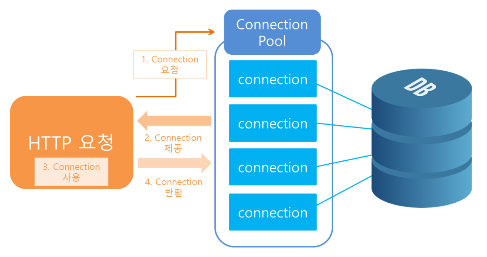
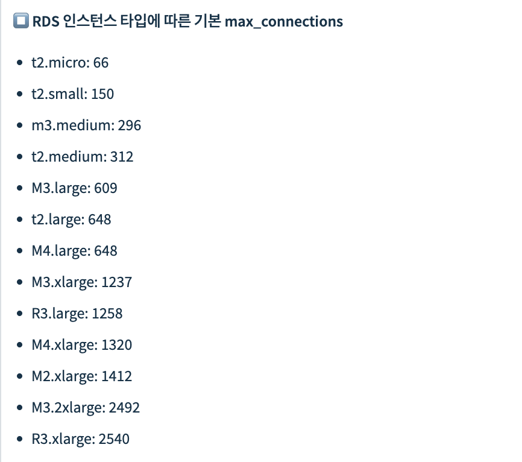
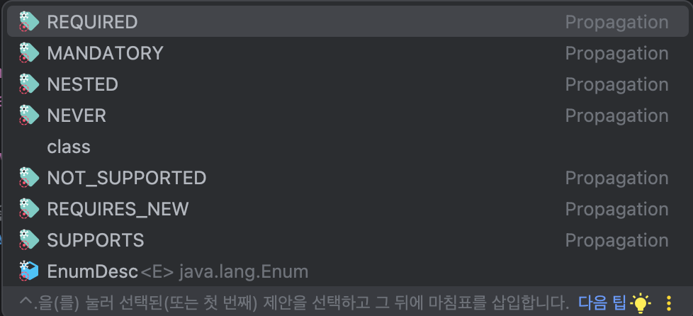
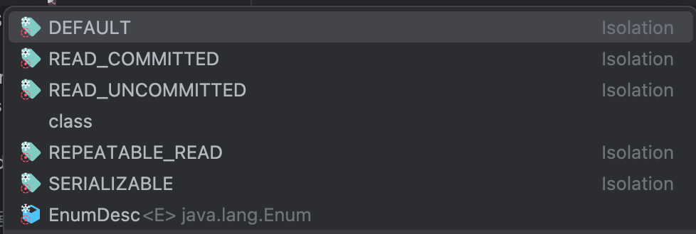
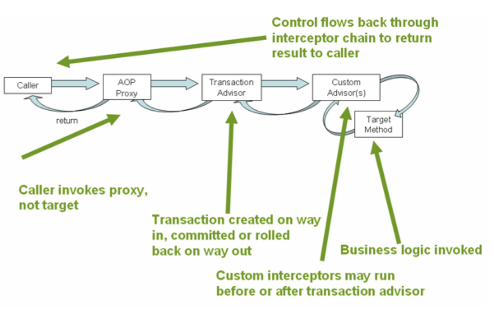

## DB 커넥션 풀 (DBCP)

### DB 커넥션이란

- 데이터베이스와 애플리케이션 간 통신을 할 수 있는 수단
- 데이터베이스 드라이버와 연결 정보를 담고 있음

### 정의

- DB 연결을 효율적으로 관리하기 위한 기술
- 웹 컨테이너(WAS)가 실행될 때 DB와 미리 연결해둔 객체를 풀에 생성해두고 관리하는 기법
- 애플리케이션과 DB 사이의 연결을 재사용
- 매번 사용자가 요청을 할 때마다 드라이버를 로드하고, 커넥션 객체를 생성해서 연결하는 과정은 매우 비효율적이기에 사용

### 특징

- 여러명의 동시 사용자가 DB에 접근할 때 사용 가능한 커넥션이 없다면 생길 때까지 대기
  - 지정된 Timeout 시간까지 대기하다가 시간이 만료되면 예외를 던짐

- 연결 생성 및 해제 시간이 감소하여 성능이 전체적으로 개선됨
- 멀티스레드에서 안정적으로 동작할 수 있음
- 하지만 커넥션 풀에서 생성되어있는 커넥션은 사용하지 않더라도 메모리를 사용하게 됨
  - 메모리와 동시 응답률의 트레이드 오프 관계에 존재함

#### RDS에서 인스턴스 타입에 따른 기본 max_connections

- 메모리에 따라 미리 적정한 Connection 수를 지정해두고 있음

## Transactional 어노테이션 동작 방식

### 트랜잭션

- 단일 작업 단위로 실행되는 하나 이상의 데이터베이스 시퀀스
- ACID 원칙을 적용해 일관성과 무결성을 보장함
  - 원자성, 일관성, 격리성, 내구성

### @Transactional

- 이러한 트랜잭션을 관리하는데 사용되는 어노테이션
- 선언적 방법으로, 클래스나 메서드 레벨에 적용이 가능
  - 클래스 수준: 클래스의 모든 메서드에 대한 기본 트랜잭션 설정을 관리함
  - 메서드 수준: 해당 특정 메서드의 class-level settings 값을 오버라이딩 하여 사용함

#### 지원하는 설정

##### 전파 유형

- propagation attribute(전파 속성)을 사용하여 트랜잭션 전파 유형을 지정할 수 있음

1. Required
   - 기본 전파 유형
   - 트랜잭션이 이미 있는 경우 현재 메서드가 해당 트랜잭션에 참여
   - 트랜잭션이 존재하지 않으면 메서드에 대한 새 트랜잭션이 생성됨
2. Requires New
   - 항상 새로운 트랜잭션을 만드는 방식
   - 이미 존재하는 경우 새로운 트랜잭션을 일시 중단함
3. Nested
   - 중첩된 트랜잭션을 생성함
   - 트랜잭션이 이미 존재하는 경우 새로운 트랜잭션이 생성되어 기존 트랜잭션 내에 중첩됨
   - 트랜잭션이 존재하지 않으면 새로운 트랜잭션이 생성됨
4. Supports
   - 트랜잭션이 이미 존재하는 경우 해당 트랜잭션 내에서 메서드가 실행됨
   - 트랜잭션이 존재하지 않으면 트랜잭션 없이 메서드가 실행됨
5. Mandatory
   - 트랜잭션이 이미 존재해야하는 방식
   - 존재하지 않으면 예외가 발생함
6. Not Supported
   - 트랜잭션을 지원하지 않음
   - 이미 트랜잭션이 있으면 현재 메서드가 실행되는 동안 트랜잭션이 일시 중단됨
7. Never
   - 현재 메서드가 실행될 때 트랜잭션이 존재하지 않는지 확인함
   - 트랜잭션이 존재하면 예외가 발생

##### 격리 수준

- 동시성을 가진 트랜잭션에 의해 적용된 변경사항이 서로에게 표시되는 방식을 설명함

###### 동시성을 가진 트랜잭션의 부작용

1. Dirty read
   - 동시에 실행하는 트랜잭션의 커밋되지 않은 변경 내용을 읽음
2. Nonrepeatable read
   - 동시에 실행하는 트랜잭션이 동일한 행을 업데이트하고 커밋하는 경우 해당 부분을 다시 읽을 때 다른 값을 가져옴
3. Phantom read
   - 다른 트랜잭션이 일부 행을 추가 제거한 뒤 커밋했을 때 range-query를 다시 실행한 후 다른 행을 가져옴
   - 한 트랜잭션에서 동일한 쿼리를 두 번 실행했을 때 두 쿼리의 결과가 다를 수 있음

###### 이를 방지하기 위한 격리 수준

1. Read Uncommitted
   - 일반적으로 사용되는 기본 격리 수준
   - 가장 낮은 수준이며, 가장 많은 동시 액세스를 허용함
   - 위 세 가지 동시성 부작용이 모두 발생할 수 있음
2. Read Committed
   - Dirty read 를 방지할 수 있는 격리 수준
   - 커밋된 데이터에 대해서는 다시 쿼리하여 결과가 바뀔 수 있음
3. Repeatable Read
   - Dirty read, Nonrepeatable read를 방지할 수 있는 격리 수준
   - range-query를 다시 실행할 때 새로 추가되거나 제거된 행의 데이터를 얻을 수 있음
   - 한 행에 대한 동시 액세스를 허용하지 않기 때문에 업데이트 손실이 발생하지 않음
4. Serializable
   - 가장 높은 격리 수준
   - 위 세 가지 동시성 부작용을 모두 방지함
   - 동시에 호출된 트랜잭션을 순차적으로 실행하기 때문에 동시성 처리율이 낮아질 수밖에 없음

##### 래핑된 연산에 대한 시간제한

- 트랜잭션이 주어진 시간에 완료되어야할 경우 제한을 설정함
- 기본은 timeout이 지원되지 않음

##### readOnly Flag

- 읽기 전용으로 설정이 가능함
- 해당 설정이 적용되었다고 insert 또는 update가 발생하지 않는다고 확신할 수 없음
- 강제로 플러시를 호출하지 않는 한 플러시가 발생하지 않게 됨
- 스냅샷을 저장하거나 변경 감지를 할 필요가 없기 때문에, 성능 향상을 기대할 수 있음
- 하지만 영속성 컨텍스트 내에서 엔티티를 관리할 수 없기 때문에 기본 캐시나 지연로딩을 사용할 수 없게 됨

##### 롤백 규칙

- 특정 예외상황에서 롤백을 하지 않도록 설정할 수 있음

#### Transactional 동작 원리

- Spring AOP를 통해 프록시 객체를 생성하여 사용함
- 타겟(Transactional 어노테이션이 붙은 메서드나 클래스)에 대한 호출이 오면, AOP 프록시가 인터셉터 체인을 통해 가져와서 트랜잭션 어드바이저에 전달
- 트랜잭션 어드바이저에서 트랜잭션 생성
- 비즈니스 로직 호출
- 트랜잭션 어드바이저에서 커밋 or 롤백 등 결과를 반환

