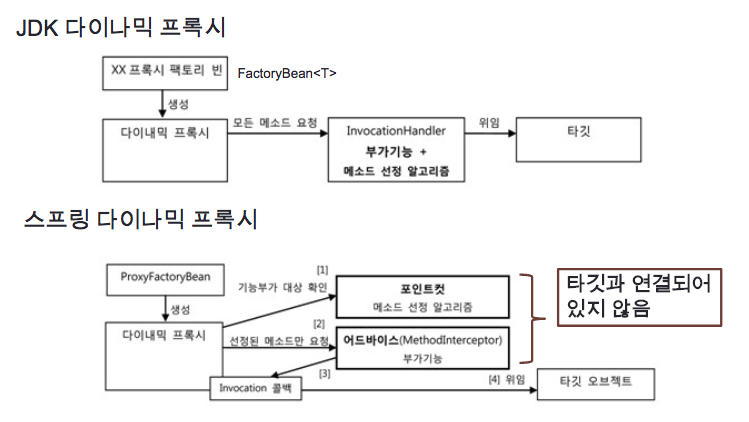

# 1주차 뒷부분

### 6.4 스프링의 프록시 팩토리 빈

스프링의 ProxyFactoryBean은 프록시를 생성해서 빈 오브젝트로 등록하게 해주는 팩토리 빈이다.

- TxProxyFactoryBean과 달리, ProxyFactoryBean은 순수하게 프록시를 생성하는 작업만을 담담하고 프록시를 통해 제공해줄 부가기능은 별도로 빈에 둘 수 있다.
- InvocationHandler가 아닌 MethodInterceptor 인터페이스를 구현해서 부가기능을 만든다.
- MethodInterceptor의 invoke() 메소드의 경우 타깃 오브젝트에 대한 정보까지 함께 제공받기 때문에 타깃 오브젝트에 대한 정보를 직접 알고 있을 필요 없이(즉, 타깃 오브젝트에 독립적으로) 만들어질 수 있다.
- 따라서, MethodInterceptor를 스프링의 싱글톤 빈으로 등록할 수 있다.
- MethodInterceptor로는 메소드 정보와 함께 타깃 오브젝트가 담긴 MethodInvocation 오브젝트가 전달된다. MethodInvocation은 타깃 오브젝트의 메소드를 실행할 수 있는 기능이 있기 때문에, MethodInterceptor는 부가기능을 제공하는 데만 집중할 수 있다.
- 부가기능을 추가하는 함수는 addAdvice()이다. 이름에서 알 수 있듯이 타깃 오브젝트에 적용하는 부가기능을 담은 오브젝트를 스프링에서는 **어드바이스(Advice)**라고 부른다.
- 부가기능을 적용할 대상을 선정하는 방식도 적용할 수 있는데, 메소드 선정 알고리즘을 담은 오브젝트를 **포인트컷(Pointcut)**이라고 부른다.

스프링의 ProxyFactoryBean을 이용한 방식은 아랫 부분과 같다.

1. 프록시는 클라이언트로부터 요청을 받으면 먼저 포인트컷에게 부가기능을 부여할 메소드인지 확인해달라고 요청한다.
2. 적용할 대상 메소드인지 확인받으면, MethodInterceptor 타입의 어드바이스를 호출한다.
3. 어드바이스가 부가기능을 부여하는 중에 타깃 메소드의 호출이 필요하면 프록시로부터 전달받은 MethodInvocation 타입 콜백 오브젝트의 proceed() 메소드를 호출한다.

### 6.5 스프링 AOP

ProxyFactoryBean까지 적용함으로써 거의 대부분의 문제는 해결했으나, 한 가지 문제가 더 남아 있다. 부가기능의 적용이 필요한 타깃 오브젝트마다 거의 비슷한 내용의 ProxyFactoryBean 빈 설정정보를 추가해주는 부분이다. target 프로퍼티를 제외하면 어드바이스, 포인트컷의 설정이 동일한테 이를 중복하여 일일이 추가해주는 것은 분명 문제가 된다.

**빈 후처리기를 이용한 자동 프록시 생성기**

빈 후처리기 자체를 빈으로 등록하게 되면, 빈 오브젝트가 생성될 때마다 빈 후처리기에 보내서 후처리 작업을 요청한다. 이때 **빈 후처리기는 빈 오브젝트의 일부를 프록시로 포장하고, 프록시를 빈으로 대신 등록할 수도 있다.**

- 스프링은 빈 오브젝트를 만들 때마다 후처리기에 빈을 보낸다. DefaultAdvisorAutoProxyCreator는 빈으로 등록된 모든 어드바이저 내의 포인트컷을 이용해 전달받은 빈이 프록시 적용 대상인지 확인한다.
- 프록시 적용 대상이면 그때는 재아된 프록시 생성기에게 현재 빈에 대한 프록시를 만들게 하고, 만들어진 프록시에 어드바이저를 연결한다.
- 원래 컨테이너가 전달해준 빈 오브젝트 대신 프록시 오브젝트를 컨테이너에 돌려주어, 이를 빈으로 등록하고 사용한다.

**포인트컷 표현식을 통해, 클래스 또는 메소드에 대해 프록시 적용 대상인지 확인할 수 있다.**

**타입 패턴(반환 타입, 매개변수 타입)과 클래스 이름 패턴을 통해 포인트컷을 적용할 수 있다.**