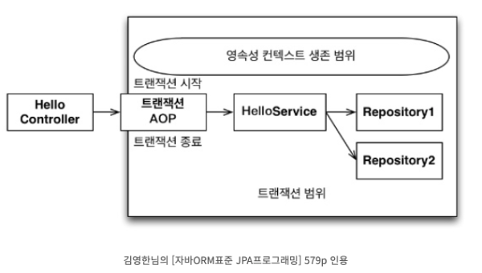
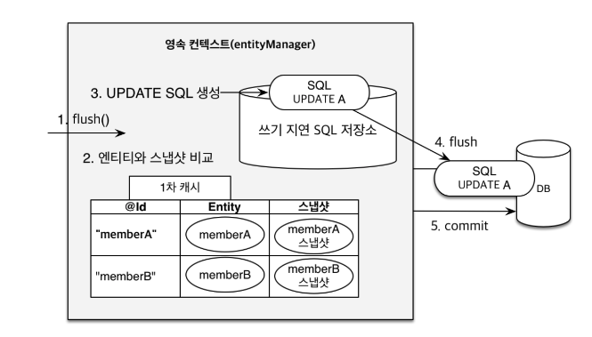
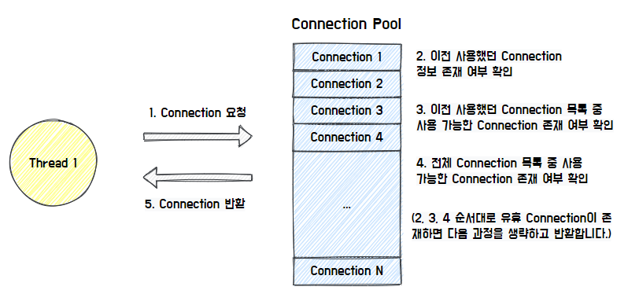
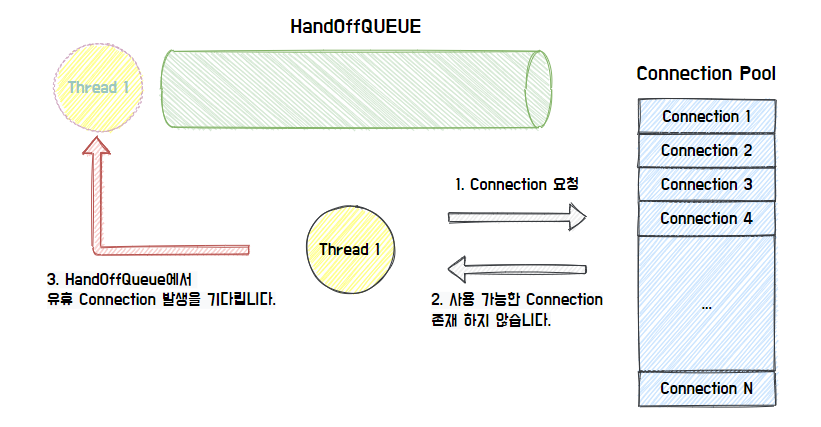
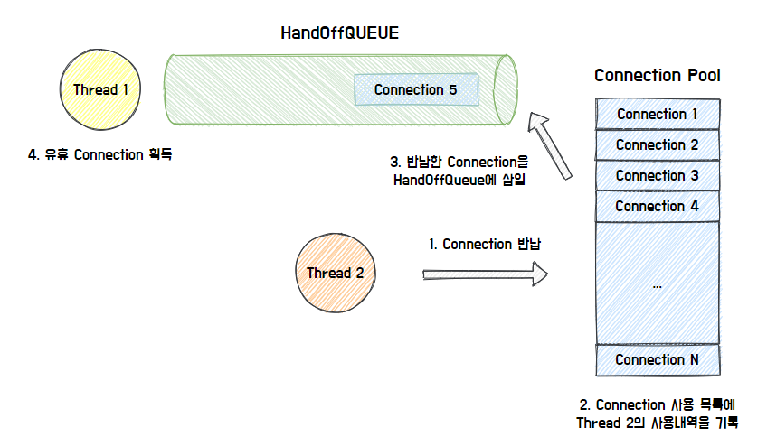

# 커넥션 풀과 트랜잭션 애노테이션

## 트랜잭션 애노테이션

지난 과제에서 프록시와 AOP에 대해서 학습하였다. Spring AOP는 기본적으로 프록시를 기반으로 하여 동작하는데, 우리가 자주 사용했던 `@Transactional` 애노테이션도 이와 같은 방법으로 적용된다.

`@Transacational` 애노테이션은 스프링 프레임워크에서 제공하는 선언적 트랜잭션 관리 기능으로, 해당 애노테이션이 붙은 메서드가 호출되면 스프링은 그 설정값을 기반으로 트랜잭션을 시작하고 종료한다.

<aside>
💡

**선언적 트랜잭션**
트랜잭션의 동작을 명시적으로 지정하지 않고, 시스템이나 프레임워크가 자동으로 트랜잭션을 관리하도록 하는 방식

**비선언적 트랜잭션**
트랜잭션의 시작, 커밋, 롤백 등을 프로그래머가 명시적으로 코드에서 직접 제어하는 방식 
트랜잭션의 관리 로직을 개발자가 직접 작성해야 한다.

</aside>

### 트랜잭션 애노테이션의 동작원리



1. **프록시 객체의 생성**

`@Transactional` 애노테이션이 붙은 클래스나 메서드가 있을 경우, 스프링은 이에 대한 프록시 객체를 생성하여 빈으로 등록한다. 이 프록시 객체는 타깃 객체를 감싸면서 전후로 트랜잭션 시작과 종료를 담당하는 코드를 실행해준다.

1. **트랜잭션의 시작**

호출한 메서드가 트랜잭션 포인트컷 대상이라면, 메서드가 호출될 때 트랜잭션 관리자(ex, PlatformTransactionManager)는 새로운 트랜잭션을 시작한다.(트랜잭션의 설정값에 따라 기존의 트랜잭션에 합쳐지거나 새로 생성될 수 있다.) 이때 트랜잭션의 속성은 `@Transactional` 어노테이션이 설정한 속성에 따라 결정된다.

1. **영속성 컨텍스트의 생성 및 연결**

트랜잭션이 시작되면, JPA를 사용할 경우 영속성 컨텍스트가 생성되고 이를 트랜잭션과 연결한다. 이렇게 만들어진 영속성 컨텍스트는 트랜잭션 범위의 영속성 컨텍스트라고 한다. 즉 트랜잭션이 시작할 때 생성되고 트랜잭션이 종료될 때 까지 유지된다.

1. **비즈니스 로직 실행**

실제 비즈니스 로직이 실행된다.

1. **트랜잭션의 커밋 또는 롤백**

비즈니스 로직의 실행이 정상적으로 끝나면, 트랜잭션 관리자는 트랜잭션을 커밋하고 영속성 컨텍스트를 종료한다.

이 과정에서 Dirty Checking이 일어나 변경된 엔티티에 대한 SQL이 DB에 반영된다. (→ ReadOnly를 적절하게 사용할 경우 성능이 좋아지는 이유가 여기서 발생한다. 하단에 이어서 작성하겠다.) 

만약 비즈니스 로직 실행 도중 예외가 발생한다면, 트랜잭션은 롤백되고 영속성 컨텍스트도 종료된다.

### 트랜잭션 애노테이션의 유의사항

**1) private 메서드는 트랜잭션을 처리할 수 없다.**

스프링 AOP에서 트랜잭션을 처리할 때 프록시를 사용한다. 이러한 프록시 객체는 타겟 객체나 타겟 인터페이스를 상속받아 생성되어 타겟 메서드를 실행하는데, private으로 선언될 경우 해당 메서드에 접근할 수 없기 때문에 private 메서드는 트랜잭션을 처리할 수 없다.

**2) 같은 클래스 내의 메서드를 호출할 때 트랜잭션이 적용되는지 확인해야 한다.**

```java
public class ExamService {
	
	@Transactional
	public void outerMethod() {
		...
		innerMethod();
		...
	}
	
	@Transactional
	public void innerMethod() {
		...
	}
}
```

위와 같은 코드가 있다고 할 때, outerMethod()를 호출할 경우 outerMethod()와 innerMethod() 모두 하나의 트랜잭션으로 적용된다. (전파속성의 디폴트 값이  REQUIRED 이므로)

하지만, 아래의 경우를 살펴보자.

```java
public class ExamService {
	
	public void outerMethod() {
		...
		innerMethod();
		...
	}
	
	@Transactional
	public void innerMethod() {
		...
	}
}
```

위와 같은 코드가 있다고 할 때, outerMethod()를 호출할 때 innerMethod()는 트랜잭션이 적용될까?

→ 아니다.

얼핏 보면 innerMethod()만 트랜잭션이 적용될 것 같지만, 아니다.

outerMethod()에는 트랜잭션이 적용되어있지 않다. 그러면서 동시에 자신 클래스 내부에 존재하는 innerMethod()를 호출한다면, 이는 프록시 객체에 있는 innerMethod()가 아닌 원본 객체의 innerMethod()를 호출할 것이기 때문이다.

생성된 프록시 객체를 살펴보면 다음과 같을 것이다.

```java
public class ExamServiceTxProxy extends ExamService {

    private TransactionManager txManager;

    @Override
    public void outerMethod() {
        // 여기서는 특별한 로직 없이 부모 클래스의 outerMethod를 그대로 호출
        super.outerMethod();
    }

    @Override
    @Transactional
    public void innerMethod() {
        try {
            // 트랜잭션 시작
            txManager.beginTransaction();
            
            // 원래 SimpleService의 innerMethod를 호출
            super.innerMethod();
            
            // 트랜잭션 커밋
            txManager.commit();
        } catch (Exception e) {
            // 예외 발생 시, 트랜잭션 롤백
            txManager.rollback();
            throw e;
        }
    }
}
```

위에서 알 수 있듯이, 프록시 객체의 outerMethod()는 트랜잭션 대상이 아니므로 super.outerMethod()를 호출하고, 이 함수는 트랜잭션이 적용되지 않은 원본 객체의 innerMethod()를 호출하기 때문에 트랜잭션이 적용되지 않음에 유의해야 한다.

**반면, 의존성 주입을 받은 다른 객체의 메서드를 호출한다면, 그 메서드가 만약 트랜잭션이 걸려있을 경우 트랜잭션이 정상적으로 적용될 것이다.**

자신 클래스의 메서드를 호출하는 것이 아니라, 의존성 주입을 받은 프록시 객체의 메서드를 호출할 것이기 때문이다.

### @Transactional(readOnly=true)가 성능적으로 좋은 이유

다음으로 readOnly=true가 성능적으로 좋은 이유를 살펴보자.

앞에서 말했듯이, JPA를 사용할때, 트랜잭션이 시작되면 영속성 컨텍스트가 생성되고 트랜잭션과 연결된다. 이때 JPA의 영속성 컨텍스트가 수행하는 **Dirty Checking**과 관련이 있다.



<aside>
💡

**Dirty Checking의 과정은 다음과 같다.**

1. 영속성 컨텍스트는 Entity 조회 시 초기 상태에 대한 SnapShot을 저장한다.
2. 그러고 나서 트랜잭션이 commit 될 때, SnapShot과 Entity의 현재상태를 비교하여 변경된 내용에 대해 update query를 생성해 쓰기 지연 SQL 저장소에 저장한다.
3. 이후, 일괄적으로 쓰기 지연 SQL 저장소에 저장되어 있는 SQL문을 실행하여 Entity의 수정이 이루어진다.
</aside>

readOnly = true 설정이 있다면, 스프링 프레임워크는 JPA의 세션 플러시 모드를 MANUAL로 설정한다.

<aside>
💡

**MANUAL 모드**는 이름 그대로 사용자가 수동으로 flush()를 호출해야만, 영속성 컨텍스트 변경 내용들이 데이터베이스에 반영되는 방식을 말한다.

</aside>

따라서 이 실정이 활성화된 트랜잭션 내에서는 flush()가 호출되지 않는 한, DB에 데이터베이스에 반영되지 않기 때문에, 데이터베이스의 일관성을 유지하는 데 도움이 된다. 

**(지난주에 readOnly=true를 설정해도 쿼리가 나갔던 이유에 대해서도 설명이 되는 부분인 것 같다.)**

**또한 readOnly = true 설정이 활성화된 트랜잭션 내에서는, 조회한 엔티티에 대해 변경 감지를 위한 스냅샷을 생성하지 않는다.**

**이러한 스냅샷을 따로 생성하지 않기 때문에, 이로 인해 발생하는 메모리 부하를 줄일 수 있다는 장점이 있다.**

---

## 커넥션 풀

### DB Connection

- DB를 사용하고 위해 DB와 어플리케이션 간의 연결을 위한 수단
- DatabaseDriver와 Database url 정보가 필요하다.

### 커넥션 풀 사용 코드

```java
Connection conn = null어
PreparedStatement  pstmt = null;
ResultSet rs = null;

try {
    sql = "SELECT * FROM T_BOARD"

    // 1. 드라이버 연결 DB 커넥션 객체를 얻음
    connection = DriverManager.getConnection(DBURL, DBUSER, DBPASSWORD);

    // 2. 쿼리 수행을 위한 PreparedStatement 객체 생성
    pstmt = conn.createStatement();

    // 3. executeQuery: 쿼리 실행 후
    // ResultSet: DB 레코드 ResultSet에 객체에 담김
    rs = pstmt.executeQuery(sql);
    } catch (Exception e) {
    } finally {
        conn.close();
        pstmt.close();
        rs.close();
    }
}
```

자바 어플리케이션에서 DB에 접속하기 위해서는 위와 같이 커넥션을 얻고, 종료하는 작업을 해줘야한다. 하지만 매번 사용자가 요청할때마다 커넥션을 생성하고 종료하는 작업을 반복한다면 비효율적일 것이다. 이런 문제를 해결하기 위해 **커넥션 풀(Connection Pool)**을 사용한다.

### 커넥션 풀(CP, Connection Pool)

WAS가 실행될 때, 미리 일정량의 Connection을 만들어서 확보한다. 이 Connection 객체들을 Pool에 저장했다가, 클라이언트 요청이 오면 Connection 객체를 빌려주고 해당 객체의 임무가 완료되면 다시 Connection Pool에 반납하는데, 바로 이 Connection 객체들을 관리하는 장소를 커넥션 풀(Connection Pool)이라 한다.


### Hikari CP

스프링부트 2.0버전 이상부터는 Hikari CP를 사용하는데, Hikari CP의 동작과정은 다음과 같다.



쓰레드가 커넥션을 요청할 때, 이전에 사용했던 커넥션이 있는지 먼저 조회한 후, 없다면 가능한 커넥션을 확인하여 확보한다.



만약 사용중인 커넥션이 없다면, HandOffQuere를 Polling 하면서 커넥션이 반환되기를 기다린다. (지정한 Timeout까지 대기하다가 시간이 만료되면 예외를 던진다.)



사용한 커넥션을 반납한다면, 커넥션 사용내역을 기록하고, 반납한 커넥션을 HandOffQueue에 삽입하고, 이때 기다리고 있는 쓰레드는 커넥션을 획득한다.

### 커넥션 풀의 장점

- 커넥션 객체를 미리 만들어 연결하여 메모리 상에 등록해두기 때문에 클라이언트가 빠르게 DB에 접속할 수 있다.
- DB 커넥션 수를 제한함으로써 과도한 접속을 방지할 수 있다.
- DB 접속 모듈을 공통화하여 DB 서버 환경이 변할 경우 비교적 쉬운 유지보수가 가능하다.
- 연결이 끝난 커넥션을 재사용함으로써 새로 객체를 생성하는 비용을 줄일 수 있다.

### 커넥션 풀의 유의점

그렇다면, 커넥션 풀에서 커넥션을 최대한 많이 만들어 놓는 것이 이득일까?

그렇지 않다. 커넥션을 미리 만들어두는 것은 메모리 공간을 차지하는 행위이기 때문에, 너무 많은 커넥션을 관리한다면 프로그램의 성능을 떨어뜨리는 원인이 된다.

**즉, 메모리 사용량 ↔ 사용자 대기시간 간의 trade-off를 잘 고려해야 한다.**

또한, 데이터베이스는 하드 디스크 하나 당 하나의 I/O를 처리한다.

즉, 특정 시점부터는 커넥션 풀 증가로 인한 성능적인 증가가 DB의 Disk 병목으로 인해 미비해질 수 있다.